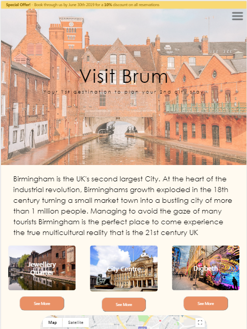

# Visit Brum Website

## Stream 2 Mileston Project - Interactive Frontend Development - Code Institute

This is a website called Visit Brum. It is a travel website designed to show the best places to visit/stay/eat/drink in Birmingham using the many tools and skills I have picked up so far 
on the course.

## Demo

A live demo of the website can be found [here](https://francisillingworth.github.io/milestone-project-2/index.html)\

## UX

The goal of my design was to create a welcoming website hightlighting the offerings Birmingham has to offer anyone coming to visit.
Visually the website is kept a simple and tidy as possible with the objective of not overloading the visitor with information. I did this by splitting Birmingham into 3 distinct major geographical 
areas. By doing this I have made the website approachable and not intimidating.

The website is designed to be as useful as possible without overloading the customer with information. There are clear links throughout the page to help the user navigate easily and intuitavely while 
also providing clear links to outside resources should the website user require further info e.g clear website links next to the name of each institiution listed on the website.

Regarding colour scheme I wanted there to be a fairly neutral colour scheme hence my choice of pastel colours. I also wanted the colours I did choose to be warm and so feel welcoming to the 
website visitor but also in a way reflect the redbrick buildings that Birmingham is famous for (hence the wide use of orange).

The webiste is obviously simplified, there is a lot more actual content that I would like to add over time but I feel what I have added in provides a good stage to display some of the skills
taught in interactive frontend development.

## Technologies

1)HTML5  
2)CSS3  
3)Bootstrap v.4.3.1  
4)Javascript  
5)Jquery  

## Features

The site features:
1) The bootstrap grid system layout.
2) A burger icon nav link that is responsive with the page nav bar so neither ever appear at the same time.
3) googleMapsJS API- with marker clusters showing the location of all places mentioned on the website
4) Embedded responsive pictures and videos.
5) EmailJS API which is linked to the contact form.

### Features left to implement

There are a few features that I would like to implement further down the line. 
1) A picture carousel on index.html and a gallery page containing additional photos of Birmingham.
2) An proper booking platform for all of the hotels/bars/restaurants etc.
3) I would like to include automated emails to the sender once the form has been submitted acknowledging receipt of email.

## Testing

The website has been tested extensively on android phones and tablets as well as iOS devices (iphone and ipad) with a font change to sans-serif required to run on iOS.
The website also runs smoothly on multiple browsers (chrome, firefox and safari).

All links to external sites open on new tabs to avoid visitor being navigated away from the website. All intenal links open within the same tab.

There are required fields in the contact us forms that will stop the form being submitted without being completed with an accompanying error message with the fault stated.
The email sections also require an email address (@)to be entered before allowing form submission.

I felt that no Jasmine tests were required as none of the functions I've included logically can provide an error (i.e there is nowhere where a word may be mistaken for a number etc)

## Deployment

The website is hosted by GitHub Pages and is deployed from the master branch. You can git clone the code to run it locally on your machine.

### Content

All content was written by myself.

## Acknowledgements

<strong>This is for educational use </strong>

